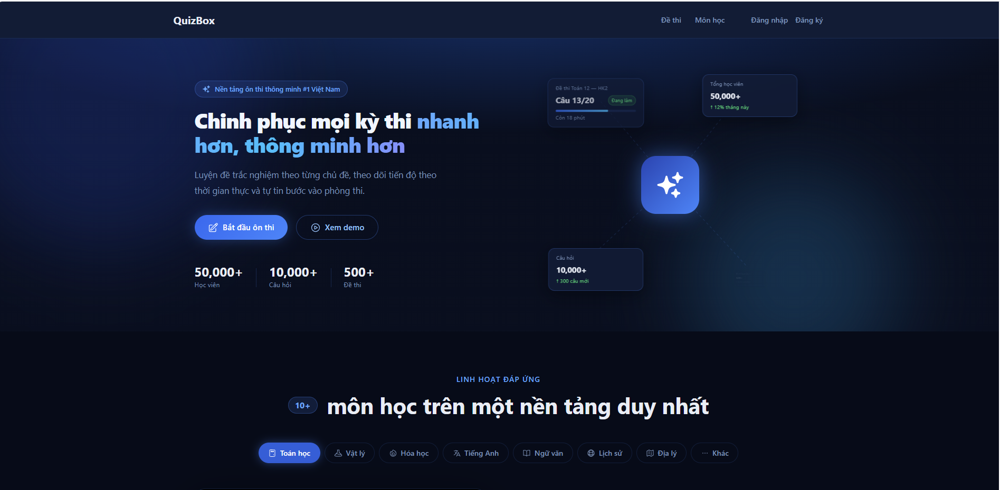

<p align="center">
  
</p>

<h1 align="center">QuizBox</h1>

<p align="center">
  <strong>Open-source quiz and learning platform built with Laravel</strong><br>
  Practice questions, evaluate knowledge, and track performance through a clean and structured system.
</p>

<p align="center">
  
  
  
  
</p>

---

## Table of Contents

* [Overview](#overview)
* [Features](#features)
* [Screenshots](#screenshots)
* [Tech Stack](#tech-stack)
* [Getting Started](#getting-started)
* [Configuration](#configuration)
* [Database Schema](#database-schema)
* [Contributing](#contributing)
* [Security](#security)
* [License](#license)

---

## Overview

**QuizBox** is a self-hosted, open-source web application designed for quiz-based learning and knowledge evaluation.

It provides users with a structured environment to practice multiple-choice questions, track performance, and improve learning efficiency without relying on external platforms.

The system is built following modern Laravel architecture principles, ensuring maintainability, scalability, and clean code organization.

**Who is it for?**

* Students preparing for exams or assessments
* Developers looking for a real-world Laravel project
* Educators building custom testing systems

---

## Features

### Authentication and Security

* Secure user registration and login
* Password hashing and validation
* Middleware-based route protection
* Role-based access control (admin and user)

### Quiz Management

* Create and manage quizzes
* Multiple-choice question system
* Randomized question delivery
* Flexible quiz structure

### Result and Evaluation

* Automatic score calculation
* Result storage per user
* Performance tracking across attempts
* Extendable analytics system

### Administration

* Full CRUD for quizzes and questions
* User management
* Centralized control panel

### User Interface

* Responsive layout using Tailwind CSS
* Clean and minimal design
* Optimized rendering with Blade templates

---

## Screenshots

<p align="center">
  
  <br><em>Dashboard showing quiz activity and summary</em>
</p>

<p align="center">
  
  <br><em>Quiz interface for answering questions</em>
</p>

<p align="center">
  
  <br><em>Result page displaying score and feedback</em>
</p>

<p align="center">
  
  <br><em>Admin panel for managing system data</em>
</p>

---

## Tech Stack

| Layer      | Technology             |
| ---------- | ---------------------- |
| Framework  | Laravel 12             |
| Language   | PHP 8.3                |
| Database   | MySQL                  |
| Frontend   | Blade and Tailwind CSS |
| Build Tool | Vite                   |

---

## Getting Started

### Prerequisites

* PHP version 8.2 or higher
* Composer
* MySQL or compatible database
* Node.js and NPM

---

### Installation

**1. Clone the repository**

```bash
git clone https://github.com/scoppy9201/Quizbox
cd quizbox
```

---

**2. Install dependencies**

```bash
composer install
npm install
```

---

**3. Set up environment**

```bash
cp .env.example .env
php artisan key:generate
```

---

**4. Configure database**

Edit `.env` file:

```env
DB_CONNECTION=mysql
DB_HOST=127.0.0.1
DB_PORT=3306
DB_DATABASE=quiz_box
DB_USERNAME=root
DB_PASSWORD=
```

---

**5. Run migrations and seed data**

```bash
php artisan migrate --seed
```

---

**6. Start development server**

```bash
php artisan serve
npm run dev
```

Application will be available at:

```
http://localhost:8000
```

---

## Configuration

The system can be extended with additional features such as:

* Timed quizzes
* Leaderboards
* Category-based filtering
* Exportable reports

---

## Database Schema

| Table     | Purpose               |
| --------- | --------------------- |
| users     | User accounts         |
| quizzes   | Quiz definitions      |
| questions | Question storage      |
| results   | User performance data |

Detailed structure can be found in the migration files.

---

## Contributing

To contribute to this project:

1. Fork the repository
2. Create a new branch
3. Commit your changes
4. Push to your branch
5. Submit a pull request

Ensure your code follows the existing structure and standards.

---

## Security

If you discover any security vulnerability, do not open a public issue.
Please report it privately via email for responsible disclosure.

---

## License

This project is licensed under the MIT License.

---

<p align="center">
  Developed by <strong>Manh Hung</strong><br>
  Fullstack Developer
</p>

<p align="center">
  Star the repository · Report issues · Request features
</p>
